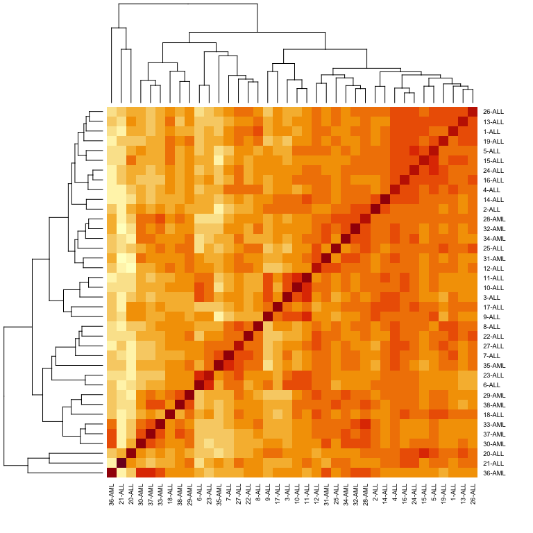
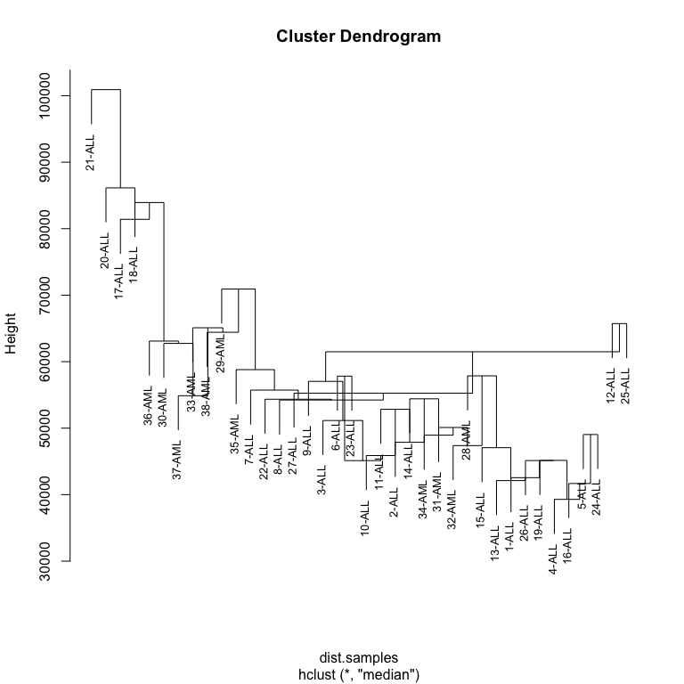
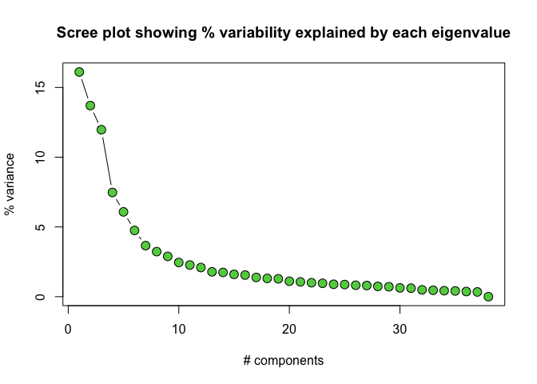
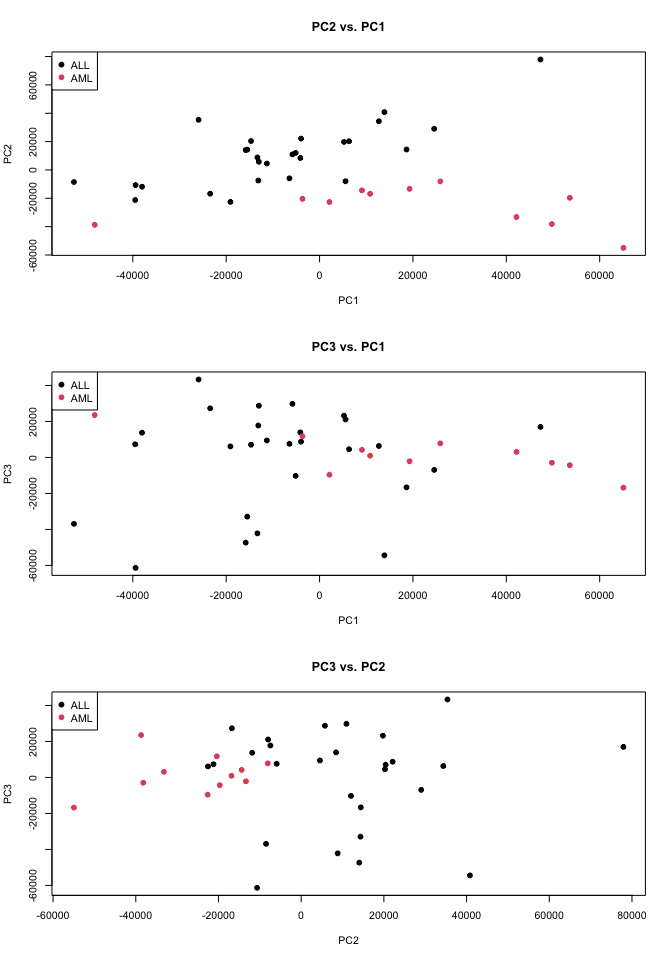

golub
================
Libby Reeves
2026-07-27

## Introduction to the Golub data set

TODO clean this up Gene expression data (3051 genes and 38 tumor mRNA
samples) from the leukemia microarray study of Golub et al. (1999).
Pre-processing was done as described in Dudoit et al. (2002). Some
patients had ALL (acute lymphoblastic leukemia) while the rest had AML
(acute myeloid leukemia).

## Loading the Golub data set and formatting for use

``` r
library(golubEsets)
data(Golub_Train)

data <- exprs(Golub_Train)
ann <- pData(Golub_Train)
```

Dimensions and data from the golub dataset:

``` r
dim(data)
```

    ## [1] 7129   38

``` r
data[1:5][1:5]
```

    ## [1] -214 -153  -58   88 -295

Length and content of the golub annotation (classes):

``` r
dim(ann)
```

    ## [1] 38 11

``` r
colnames(ann)
```

    ##  [1] "Samples"   "ALL.AML"   "BM.PB"     "T.B.cell"  "FAB"       "Date"     
    ##  [7] "Gender"    "pctBlasts" "Treatment" "PS"        "Source"

``` r
ann[1:5][1:5]
```

    ##    Samples ALL.AML BM.PB T.B.cell  FAB
    ## 1        1     ALL    BM   B-cell <NA>
    ## 2        2     ALL    BM   T-cell <NA>
    ## 3        3     ALL    BM   T-cell <NA>
    ## 4        4     ALL    BM   B-cell <NA>
    ## 5        5     ALL    BM   B-cell <NA>
    ## 6        6     ALL    BM   T-cell <NA>
    ## 7        7     ALL    BM   B-cell <NA>
    ## 8        8     ALL    BM   B-cell <NA>
    ## 9        9     ALL    BM   T-cell <NA>
    ## 10      10     ALL    BM   T-cell <NA>
    ## 11      11     ALL    BM   T-cell <NA>
    ## 12      12     ALL    BM   B-cell <NA>
    ## 13      13     ALL    BM   B-cell <NA>
    ## 14      14     ALL    BM   T-cell <NA>
    ## 15      15     ALL    BM   B-cell <NA>
    ## 16      16     ALL    BM   B-cell <NA>
    ## 17      17     ALL    BM   B-cell <NA>
    ## 18      18     ALL    BM   B-cell <NA>
    ## 19      19     ALL    BM   B-cell <NA>
    ## 20      20     ALL    BM   B-cell <NA>
    ## 21      21     ALL    BM   B-cell <NA>
    ## 22      22     ALL    BM   B-cell <NA>
    ## 23      23     ALL    BM   T-cell <NA>
    ## 24      24     ALL    BM   B-cell <NA>
    ## 25      25     ALL    BM   B-cell <NA>
    ## 26      26     ALL    BM   B-cell <NA>
    ## 27      27     ALL    BM   B-cell <NA>
    ## 34      34     AML    BM     <NA>   M2
    ## 35      35     AML    BM     <NA>   M1
    ## 36      36     AML    BM     <NA>   M5
    ## 37      37     AML    BM     <NA>   M2
    ## 38      38     AML    BM     <NA>   M1
    ## 28      28     AML    BM     <NA>   M2
    ## 29      29     AML    BM     <NA>   M2
    ## 30      30     AML    BM     <NA>   M5
    ## 31      31     AML    BM     <NA>   M4
    ## 32      32     AML    BM     <NA>   M1
    ## 33      33     AML    BM     <NA>   M2

## Hierarchical clustering and correlation of samples with heatmap

``` r
colnames(data) <- paste(ann$Samples, ann$ALL.AML, sep='-')
data.cor <- cor(data)
heatmap(data.cor, cexRow=0.7, cexCol=0.7)
```

<!-- -->

``` r
dist.samples <- dist(t(data))
hc.samples <- hclust(dist.samples, method='median')
plot(hc.samples, cex=0.8)
```

<!-- -->

## PCA

``` r
data.pca <- prcomp(t(data))
data.loadings <- data.pca$x

data.pca.var <- round(data.pca$sdev^2 / sum(data.pca$sdev^2)*100,2)
plot(c(1:length(data.pca.var)), data.pca.var, type="b", xlab="# components",
     ylab="% variance", pch=21, col=1, bg=3, cex=1.5,
     main="Scree plot showing % variability explained by each eigenvalue")
```

<!-- -->

``` r
par(mfrow=c(3, 1))

plot(data.loadings[, 1], data.loadings[, 2], xlab='PC1', ylab='PC2', pch=19,
     col=as.numeric(as.factor(ann$ALL.AML)), main="PC2 vs. PC1")
legend('topleft', legend=levels(as.factor(ann$ALL.AML)),
       col=1:length(levels(as.factor(ann$ALL.AML))), pch=c(19, 19))

plot(data.loadings[, 1], data.loadings[, 3], xlab='PC1', ylab='PC3', pch=19,
     col=as.numeric(as.factor(ann$ALL.AML)), main="PC3 vs. PC1")
legend('topleft', legend=levels(as.factor(ann$ALL.AML)),
       col=1:length(levels(as.factor(ann$ALL.AML))), pch=c(19, 19))

plot(data.loadings[, 2], data.loadings[, 3], xlab='PC2', ylab='PC3', pch=19,
     col=as.numeric(as.factor(ann$ALL.AML)), main="PC3 vs. PC2")
legend('topleft', legend=levels(as.factor(ann$ALL.AML)),
       col=1:length(levels(as.factor(ann$ALL.AML))), pch=c(19, 19))
```

<!-- -->
