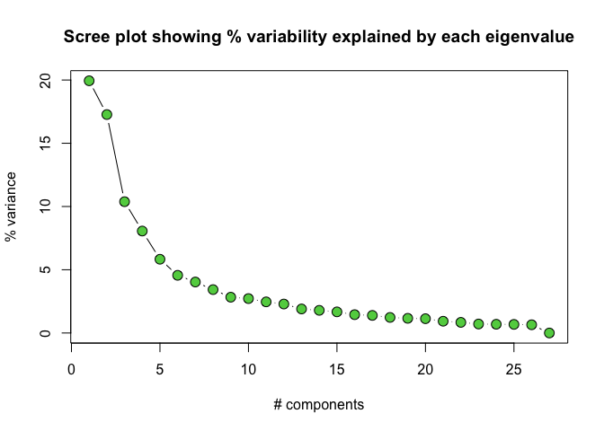
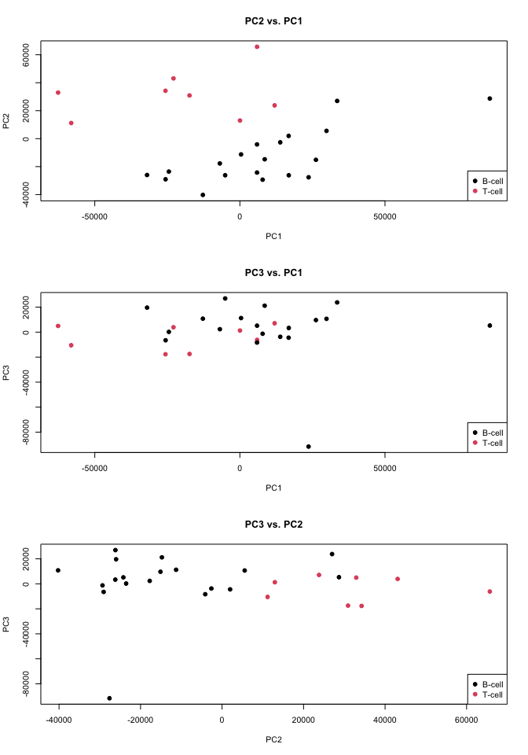
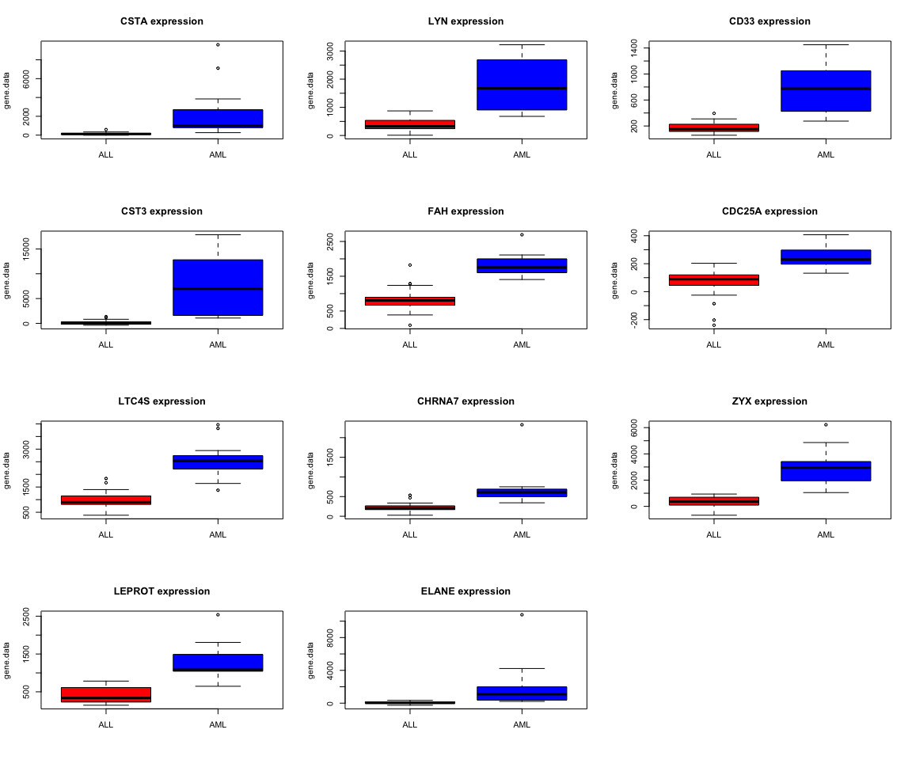

golub
================
Libby Reeves
2026-07-28

## Introduction to the Golub data set

TODO clean this up Gene expression data (3051 genes and 38 tumor mRNA
samples) from the leukemia microarray study of Golub et al. (1999).
Pre-processing was done as described in Dudoit et al. (2002). Some
patients had ALL (acute lymphoblastic leukemia) while the rest had AML
(acute myeloid leukemia).

## Loading the Golub data set and formatting for use

``` r
library(golubEsets)
data(Golub_Train)

data <- exprs(Golub_Train)
ann <- pData(Golub_Train)
```

Dimensions and data from the golub dataset:

``` r
dim(data)
```

    ## [1] 7129   38

``` r
data[1:5][1:5]
```

    ## [1] -214 -153  -58   88 -295

Length and content of the golub annotation (classes):

``` r
dim(ann)
```

    ## [1] 38 11

``` r
colnames(ann)
```

    ##  [1] "Samples"   "ALL.AML"   "BM.PB"     "T.B.cell"  "FAB"       "Date"     
    ##  [7] "Gender"    "pctBlasts" "Treatment" "PS"        "Source"

``` r
ann[1:5][1:5]
```

    ##    Samples ALL.AML BM.PB T.B.cell  FAB
    ## 1        1     ALL    BM   B-cell <NA>
    ## 2        2     ALL    BM   T-cell <NA>
    ## 3        3     ALL    BM   T-cell <NA>
    ## 4        4     ALL    BM   B-cell <NA>
    ## 5        5     ALL    BM   B-cell <NA>
    ## 6        6     ALL    BM   T-cell <NA>
    ## 7        7     ALL    BM   B-cell <NA>
    ## 8        8     ALL    BM   B-cell <NA>
    ## 9        9     ALL    BM   T-cell <NA>
    ## 10      10     ALL    BM   T-cell <NA>
    ## 11      11     ALL    BM   T-cell <NA>
    ## 12      12     ALL    BM   B-cell <NA>
    ## 13      13     ALL    BM   B-cell <NA>
    ## 14      14     ALL    BM   T-cell <NA>
    ## 15      15     ALL    BM   B-cell <NA>
    ## 16      16     ALL    BM   B-cell <NA>
    ## 17      17     ALL    BM   B-cell <NA>
    ## 18      18     ALL    BM   B-cell <NA>
    ## 19      19     ALL    BM   B-cell <NA>
    ## 20      20     ALL    BM   B-cell <NA>
    ## 21      21     ALL    BM   B-cell <NA>
    ## 22      22     ALL    BM   B-cell <NA>
    ## 23      23     ALL    BM   T-cell <NA>
    ## 24      24     ALL    BM   B-cell <NA>
    ## 25      25     ALL    BM   B-cell <NA>
    ## 26      26     ALL    BM   B-cell <NA>
    ## 27      27     ALL    BM   B-cell <NA>
    ## 34      34     AML    BM     <NA>   M2
    ## 35      35     AML    BM     <NA>   M1
    ## 36      36     AML    BM     <NA>   M5
    ## 37      37     AML    BM     <NA>   M2
    ## 38      38     AML    BM     <NA>   M1
    ## 28      28     AML    BM     <NA>   M2
    ## 29      29     AML    BM     <NA>   M2
    ## 30      30     AML    BM     <NA>   M5
    ## 31      31     AML    BM     <NA>   M4
    ## 32      32     AML    BM     <NA>   M1
    ## 33      33     AML    BM     <NA>   M2

## Hierarchical clustering and correlation of samples with heatmap

``` r
colnames(data) <- paste(ann$Samples, ann$ALL.AML, sep='-')
data.cor <- cor(data)
heatmap(data.cor, cexRow=0.7, cexCol=0.7)
```

<!-- -->

``` r
dist.samples <- dist(t(data))
hc.samples <- hclust(dist.samples, method='median')
plot(hc.samples, cex=0.8)
```

<!-- -->

## PCA

``` r
data.pca <- prcomp(t(data))
data.loadings <- data.pca$x

data.pca.var <- round(data.pca$sdev^2 / sum(data.pca$sdev^2)*100, 2)
plot(c(1:length(data.pca.var)), data.pca.var, type="b", xlab="# components",
     ylab="% variance", pch=21, col=1, bg=3, cex=1.5,
     main="Scree plot showing % variability explained by each eigenvalue")
```

<!-- -->

``` r
par(mfrow=c(3, 1))

plot(data.loadings[, 1], data.loadings[, 2], xlab='PC1', ylab='PC2', pch=19,
     col=as.numeric(as.factor(ann$ALL.AML)), main="PC2 vs. PC1")
legend('topleft', legend=levels(as.factor(ann$ALL.AML)),
       col=1:length(levels(as.factor(ann$ALL.AML))), pch=c(19, 19))

plot(data.loadings[, 1], data.loadings[, 3], xlab='PC1', ylab='PC3', pch=19,
     col=as.numeric(as.factor(ann$ALL.AML)), main="PC3 vs. PC1")
legend('topleft', legend=levels(as.factor(ann$ALL.AML)),
       col=1:length(levels(as.factor(ann$ALL.AML))), pch=c(19, 19))

plot(data.loadings[, 2], data.loadings[, 3], xlab='PC2', ylab='PC3', pch=19,
     col=as.numeric(as.factor(ann$ALL.AML)), main="PC3 vs. PC2")
legend('topleft', legend=levels(as.factor(ann$ALL.AML)),
       col=1:length(levels(as.factor(ann$ALL.AML))), pch=c(19, 19))
```

<!-- -->

## PCA within ALL data: B-cell vs. T-cell

``` r
data.all <- data[, ann$ALL.AML=='ALL']

data.all.pca <- prcomp(t(data.all))
data.all.loadings <- data.all.pca$x

data.all.pca.var <- round(data.all.pca$sdev^2 / sum(data.all.pca$sdev^2)*100, 2)
plot(c(1:length(data.all.pca.var)), data.all.pca.var, type="b", 
     xlab="# components", ylab="% variance", pch=21, col=1, bg=3, cex=1.5,
     main="Scree plot showing % variability explained by each eigenvalue")
```

<!-- -->

``` r
par(mfrow=c(3, 1))
t.b.cell <- as.factor(ann$T.B.cell)

plot(data.all.loadings[, 1], data.all.loadings[, 2], xlab='PC1', ylab='PC2',
     pch=19, col=as.numeric(t.b.cell), main="PC2 vs. PC1")
legend('bottomright', legend=levels(t.b.cell),
       col=1:length(levels(t.b.cell)), pch=c(19, 19))

plot(data.all.loadings[, 1], data.all.loadings[, 3], xlab='PC1', ylab='PC3',
     pch=19, col=as.numeric(t.b.cell), main="PC3 vs. PC1")
legend('bottomright', legend=levels(t.b.cell),
       col=1:length(levels(t.b.cell)), pch=c(19, 19))

plot(data.all.loadings[, 2], data.all.loadings[, 3], xlab='PC2', ylab='PC3',
     pch=19, col=as.numeric(t.b.cell), main="PC3 vs. PC2")
legend('bottomright', legend=levels(t.b.cell),
       col=1:length(levels(t.b.cell)), pch=c(19, 19))
```

<!-- -->

## Testing for differentially expressed genes

``` r
wilcox.test.all.genes <- function(x, s1, s2) {
    x1 <- as.numeric(x[s1])
    x2 <- as.numeric(x[s2])
    w.out <- wilcox.test(x1, x2, exact=F, alternative='two.sided', correct=T)
    #out <- as.numeric(w.out$statistic)
    out <- as.numeric(w.out$p.value)
    #print(p.val)
    return(out)
}

wilcox.results <- apply(data, 1, wilcox.test.all.genes,
                    s1 = ann$ALL.AML=='ALL', s2 = ann$ALL.AML=='AML')

head(wilcox.results)
```

    ##  AFFX-BioB-5_at  AFFX-BioB-M_at  AFFX-BioB-3_at  AFFX-BioC-5_at  AFFX-BioC-3_at 
    ##     0.094131146     0.350522975     0.562278441     0.003578827     0.974322947 
    ## AFFX-BioDn-5_at 
    ##     0.540789628

``` r
# multiple testing correction

# Benjamini-Hochberg
wilcox.bh <- p.adjust(wilcox.results, method='BH')

wilcox.bh.sig.05 <- wilcox.bh[wilcox.bh < 0.05]
wilcox.bh.sig.01 <- wilcox.bh[wilcox.bh < 0.01]

length(wilcox.bh.sig.01)
```

    ## [1] 72

``` r
# Bonferroni - more conservative
wilcox.bonferroni <- p.adjust(wilcox.results, method='bonferroni')
wilcox.bonferroni.sig.05 <- wilcox.bonferroni[wilcox.bonferroni < 0.05]

length(wilcox.bonferroni.sig.05)
```

    ## [1] 11

## Some genes of interest in AML and ALL

``` r
library(hu6800.db)
```

    ## Loading required package: AnnotationDbi

    ## Loading required package: stats4

    ## Loading required package: IRanges

    ## Loading required package: S4Vectors

    ## 
    ## Attaching package: 'S4Vectors'

    ## The following object is masked from 'package:utils':
    ## 
    ##     findMatches

    ## The following objects are masked from 'package:base':
    ## 
    ##     expand.grid, I, unname

    ## Loading required package: org.Hs.eg.db

    ## 

    ## 

``` r
library(AnnotationDbi)

genes.of.interest <- c('FLT3', 'NPM1', 'IDH1', 'IDH2', 'DNMT3A', 'TET2',
                       'ASXL1', 'TP53', 'NOTCH1', 'PAX5', 'IKZF1')

probe.ids <- featureNames(Golub_Train)
gene.symbols <- mapIds(
  x = hu6800.db,           # The chip database
  keys = probe.ids,        # Your array probe IDs
  column = "SYMBOL",       # Target identifier type
  keytype = "PROBEID",     # Source identifier type
  multiVals = "first"      # How to handle multi-mapping probes
)
```

    ## 'select()' returned 1:many mapping between keys and columns

``` r
gene.symbols <- na.omit(gene.symbols)
symbols.of.interest <- gene.symbols[gene.symbols %in% genes.of.interest]
symbols.of.interest
```

    ## M22898_at M23613_at M96944_at U02687_at U40462_at U62389_at X69433_at 
    ##    "TP53"    "NPM1"    "PAX5"    "FLT3"   "IKZF1"    "IDH1"    "IDH2"

## Genes with most significant expression difference between ALL and AML

``` r
sig.probe.ids <- names(wilcox.bonferroni.sig.05)

sig.genes <- gene.symbols[names(gene.symbols) %in% sig.probe.ids]

sig.data <- data.frame('probe_id'=names(sig.genes), 'gene_name'=sig.genes,
                       'p_value'=wilcox.bonferroni.sig.05)
sig.data
```

    ##                      probe_id gene_name    p_value
    ## D88422_at           D88422_at      CSTA 0.03467877
    ## M16038_at           M16038_at       LYN 0.04041621
    ## M23197_at           M23197_at      CD33 0.03459608
    ## M27891_at           M27891_at      CST3 0.01861081
    ## M55150_at           M55150_at       FAH 0.04036865
    ## M81933_at           M81933_at    CDC25A 0.04683781
    ## U50136_rna1_at U50136_rna1_at     LTC4S 0.02969023
    ## X70297_at           X70297_at    CHRNA7 0.04041621
    ## X95735_at           X95735_at       ZYX 0.01355236
    ## Y12670_at           Y12670_at    LEPROT 0.04036865
    ## M27783_s_at       M27783_s_at     ELANE 0.02969023

``` r
# TODO maybe remove row names?
```

## Gene expression box plots

``` r
par(mfrow=c(4, 3))
make.boxplots <- function(gene.symbol) {
  probe.id <- names(gene.symbols[gene.symbols==gene.symbol])[1]
  print(probe.id)
  gene.data <- data[probe.id, ]
  length(gene.data)
  boxplot(gene.data ~ ann$ALL.AML, col=c('red', 'blue'), xlab='',
          main=paste(gene.symbol, 'expression'))
}

for (symbol in sig.data$gene_name) {
  make.boxplots(symbol)
}
```

    ## [1] "D88422_at"

    ## [1] "M16038_at"

    ## [1] "M23197_at"

    ## [1] "M27891_at"

    ## [1] "M55150_at"

    ## [1] "M81933_at"

    ## [1] "U50136_rna1_at"

    ## [1] "X70297_at"

    ## [1] "X95735_at"

    ## [1] "Y12670_at"

    ## [1] "M27783_s_at"

<!-- -->
